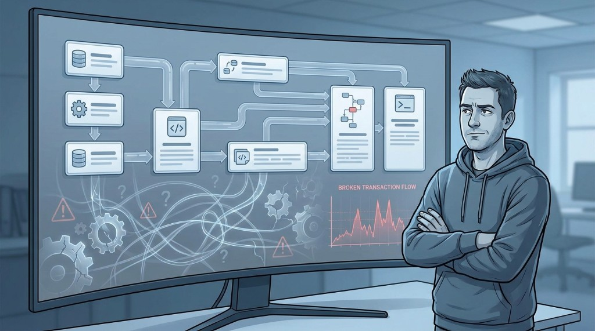
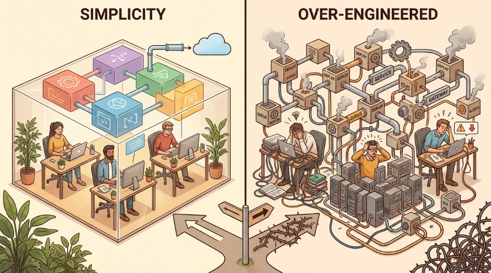
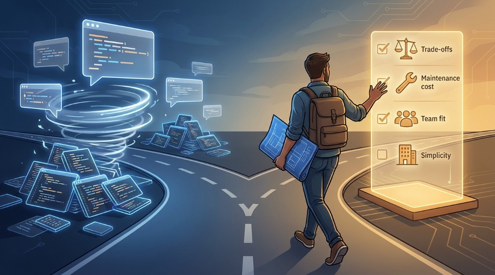

AI has become one of the hottest topics in software development. And it’s easy to see why. Tools powered by language models can generate code, write tests, suggest a project structure, describe API endpoints, prepare documentation, or help track down bugs.

For a fullstack developer, this is a real productivity boost. For a technical leader, it can be a great way to explore options and organize ideas.

But there is one trap we don’t talk about enough.

Just because AI can quickly suggest a solution doesn’t mean it can make a good architectural decision.

And in practice, this is where the biggest problems begin.

## Code Is Not the Same as a Decision

In everyday work, it’s easy to confuse two things:

- generating a solution,
- making a good technical decision.

AI is very good at the first one. It can quickly create an implementation example, suggest a pattern, outline a folder structure, or generate a high-level architecture draft.

But software architecture is not just about answering the question:

> “How do we build this?”

The more important questions are:

- Why this way?
- What do we gain from this decision?
- What do we lose?
- How much will this cost to maintain?
- Is our team ready for this level of complexity?
- Does this problem actually exist yet?
- Would a simpler solution be good enough?

That’s where the difference between fast code generation and mature technical thinking begins.

## A Professional-Sounding Answer Is Not Always a Good One

One of the biggest risks of AI is that its answers often sound very convincing.

Ask it about building a scalable system, and you may get a familiar list of recommendations:

- microservices,
- queues,
- caching,
- event-driven architecture,
- CQRS,
- separating reads from writes,
- observability,
- horizontal scaling.

On the surface, everything may look great. The answer will be structured, logical, and full of technical terminology.

The problem is that a list of popular solutions is not architecture.

Architecture starts when we understand the consequences of those choices.

## Every “Good Solution” Comes with a Cost

In system design, decisions are rarely simply good or bad. Most of the time, we are dealing with trade-offs.

What works well in one context can unnecessarily complicate a project in another.

### Microservices

Microservices can be a very good choice when you have multiple teams, clearly separated domain areas, and a real need for independent deployment cycles.

But they also come with a long list of costs:

- network communication between services,
- contract versioning,
- harder debugging,
- transaction-related challenges,
- monitoring multiple services,
- distributed tracing,
- more complex deployments,
- additional operational requirements.

If the team is small, the domain is still changing, and the product is still searching for direction, microservices may hurt more than they help.

### Caching

Caching often feels like a simple way to improve performance.

And often, it is.

But only until you need to answer questions like:

- When should cached data expire?
- How do we handle data inconsistency?
- What happens if the cache goes down?
- Can a user see stale information?
- Is the real problem a missing cache, or just a poorly written query?

Caching solves some problems, but introduces others. That’s why it shouldn’t be a default addition to every architecture.

### Events

Events can help loosen coupling between parts of a system. They are extremely useful in many business and integration scenarios.

At the same time, they make several things harder:

- following the full business process,
- debugging errors,
- handling retries,
- ensuring idempotency,
- understanding the current state of the system,
- investigating production issues.

Event-driven architecture can be a great choice. But only if we understand why we need it.

## The Most Underrated Skill: Not Adding Complexity Too Early

In software development, we often reward adding things.

Add a new technology.  
Add a queue.  
Add a separate service.  
Add a cache.  
Add another abstraction layer.  
Add a framework.

But technical maturity often means the opposite: deliberately not adding things we don’t need yet.

This is especially important in small teams and early-stage products.

If you have:

- a small development team,
- changing requirements,
- an uncertain business model,
- limited time,
- a relatively simple domain,
- no real scaling problems yet,

then the most reasonable choice may be a well-designed modular monolith.

It doesn’t sound as impressive as microservices. It doesn’t look as fancy on an architecture diagram. But very often, it is far more practical.

A modular monolith can give you:

- simpler deployments,
- easier debugging,
- lower maintenance cost,
- faster changes,
- better control over dependencies,
- the option to extract modules later, when there is a real need.

This is not a step backwards. It is a conscious architectural decision.

## AI Helps Most When You Know What to Ask

In the age of AI, a lot of attention goes to prompting. How do you write a better prompt? How do you get a more detailed answer? How do you generate more code in less time?

All of that matters.

But in the context of architecture, understanding what questions to ask matters more than prompting itself.

Instead of asking:

> “What is the best architecture for this application?”

it is better to ask:

- What assumptions must be true for this solution to make sense?
- What are the biggest risks of this approach?
- What will be hard to maintain?
- When will this solution start to limit us?
- What does a simpler version look like?
- What does a more advanced version look like?
- Which decisions will be easy to change later?
- Which decisions will be expensive to reverse?
- What would need to happen for us to truly need this complexity?

That changes the way we use AI.

The model is no longer “the architect making decisions for us.” It becomes a tool for exploring options.

## Good Architecture Depends on Context

One of the most annoying, but also most truthful, phrases in IT is:

> “It depends.”

In software architecture, it really does depend.

You design a system differently for three developers than for a platform built by thirty teams.

You make different decisions in a startup searching for product-market fit than in a large organization dealing with regulations, compliance, and many dependencies between departments.

The architecture of an app with a hundred users a day is not the same as the architecture of a payment system that must be available almost all the time.

So the question is not:

> “Which architecture is the best?”

It is rather:

> “Which trade-off is the best in our context?”

That is a fundamental difference.

## AI Will Not Take Responsibility for Production

It is worth using AI. I treat it as a tool that can speed up analysis, help organize ideas, and point out risks worth checking.

But we need to remember one thing.

AI can suggest an architecture.  
AI can generate code.  
AI can describe a pattern.  
AI can prepare a diagram.

But the team will maintain the system later.

People will diagnose production issues.  
People will deal with deployment failures.  
People will pay the cost of premature complexity.  
People will explain to the business why a supposedly simple change requires touching several services.

AI will not wake up at 3 a.m. to fix production.

The responsibility still stays with us.

## The Role of a Technical Leader in the AI Era

For software development leaders, AI changes not only the way code is written, but also the way we work with teams.

It will become increasingly important to teach people not only how to use AI tools, but also how to verify their answers.

In practice, that means building a habit in the team of asking questions like:

- Do we understand the problem we are solving?
- Does this solution fit our scale?
- Do we have the skills to maintain it?
- Are we adding complexity too early?
- Is this decision reversible?
- What will the consequences be in six months?
- What happens if the product grows?
- What happens if the product moves in a different direction?

AI can be a great partner in that discussion, but it should not replace it.

## The Future Belongs to Those Who Understand Trade-Offs

The easier it becomes to generate code, the more important this question becomes:

> “Is this code even worth writing?”

This may be one of the most important shifts in our profession.

Writing code itself will be increasingly supported by tools. But understanding the consequences of technical decisions will remain essential.

A good developer in the AI era is not only someone who can quickly generate an implementation.

It is someone who can evaluate:

- whether we are solving the right problem,
- whether we are adding unnecessary complexity,
- whether the chosen technology fits the team,
- whether the architecture addresses real needs,
- whether the maintenance cost is acceptable,
- whether a simpler solution would be enough.

That is why trade-offs are more important than prompts.

Prompts help you get an answer.  
Trade-offs help you decide whether that answer makes sense.

## Summary

AI will not replace architectural thinking. It can speed it up, structure it, and support it, but it will not take responsibility for technical decisions.

The biggest risk is not that AI generates bad code. The bigger risk is that it generates a solution that looks professional but does not fit your context.

That is why it is worth using AI, but it is even more important to build strong fundamentals:

- understanding architecture,
- analyzing costs,
- knowing constraints,
- simplifying intentionally,
- thinking in terms of consequences,
- being able to say: “We don’t need this yet.”

Because in the long run, the advantage will not belong to those who generate the most code.

It will belong to those who know **which code is worth writing** — and which complexity is worth avoiding.
