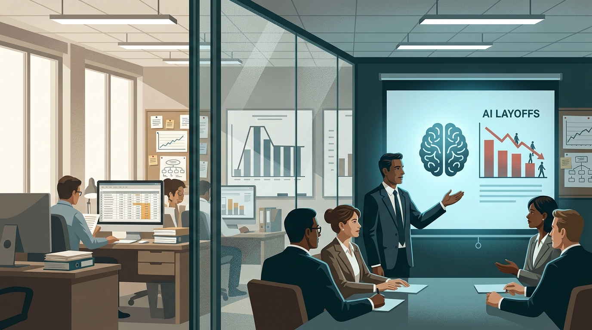
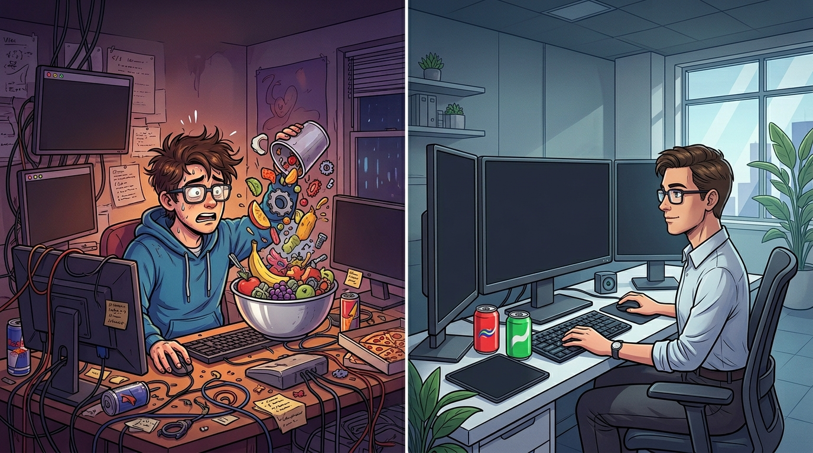
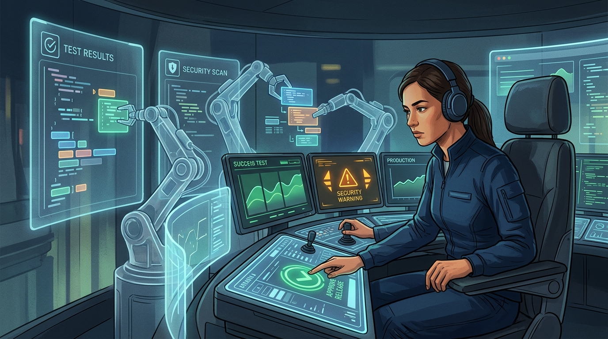
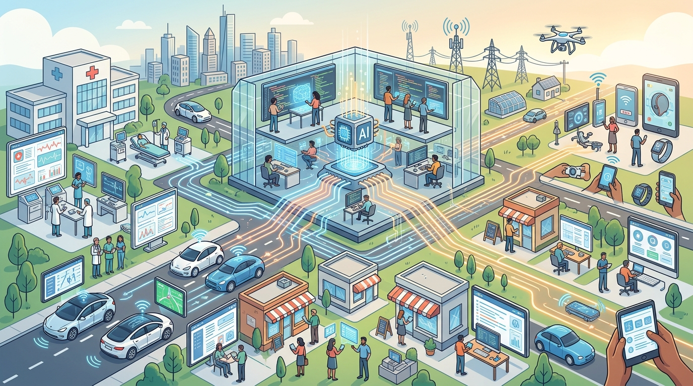
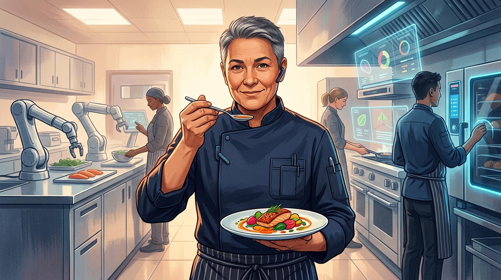

Jeśli ostatnio spędziłeś trochę czasu w internecie, pewnie znasz już tę teorię: **AI najpierw zabierze pracę programistom**.

AI potrafi pisać kod, więc według tej narracji wystarczy, że staną się w tym wystarczająco dobre, a ludziom pokaże się drzwi. Pojawiają się nagłówki o zwolnieniach, prezesi mówią o "szczuplejszych zespołach", a wszyscy kiwają głowami, jakby to było nieuniknione.

Ale gdy zajrzeć w to, co naprawdę się dzieje, ta teoria szybko się rozpada.

**Inżynieria oprogramowania** to idealne miejsce, żeby sprawdzić teorię o tym, że AI zjada miejsca pracy. To branża, w której AI ma największe możliwości, AI zostało przyjęte najszybciej i prawie nic regulacyjnie go nie hamuje.

Gdyby masowe zastępowanie ludzi miało zacząć się gdziekolwiek, zaczęłoby się tutaj. Nie zaczęło się. Dlatego warto oddzielić to, w co ludzie wierzą, od tego, co pokazują dane.

## Mit 1: Firmy zwalniają inżynierów, bo AI ich zastąpiło

Wiele z tych "**zwolnień przez AI**" to po prostu cięcia budżetowe w nowym opakowaniu.

Nazwijmy to "AI washingiem", korporacyjnym kuzynem greenwashingu. Kiedy firma musi obciąć koszty, "wykorzystujemy AI, żeby budować mniejsze i sprawniejsze zespoły" brzmi dla inwestorów znacznie lepiej niż "zatrudniliśmy za dużo ludzi i tracimy pieniądze".

Trzy głośne przykłady:

- **Block**, firma stojąca za Cash App i Square, [zwolniła około 4 tysiące osób](https://www.bloomberg.com/news/articles/2026-03-01/jack-dorsey-s-4-000-job-cuts-at-block-arouse-suspicions-of-ai-washing), a Jack Dorsey wskazywał na [postępy AI](https://www.wired.com/story/jack-dorsey-explains-block-layoffs/). Tyle że firma mniej więcej potroiła zatrudnienie w czasie pandemii i była pod mocną presją finansową. Jeden z data scientist mówił, że AI było tam ["wciskane wszystkim na siłę"](https://www.linkedin.com/posts/naoko-takeda_my-employer-block-laid-off-40-of-its-workforce-activity-7434699479389405184--D3P) przy "bardzo ograniczonych wzrostach produktywności", po czym odszedł mimo 75-procentowej podwyżki retencyjnej.
- **Snap** [zwolnił około 1000 osób](https://deadline.com/2026/04/snap-layoffs-ceo-evan-spiegel-ai-1236861335/), kiedy CEO chwalił się, że AI pisze [65% nowego kodu](https://finance.yahoo.com/sectors/technology/articles/snap-ceo-praises-ai-writing-090500386.html). Mniej efektowne tło było takie, że [aktywistyczny inwestor domagał się cięć kosztów](https://www.businesswire.com/news/home/20260331059373/en/Irenic-Sends-Letter-to-Snap-Inc.-Co-Founder-and-CEO-Evan-Spiegel-and-Issues-Presentation-Outlining-Actionable-Steps-to-Unlock-Value), a Snap od wejścia na giełdę w 2017 roku co roku notował stratę.
- **Intuit** [obciął 3000 ról](https://techcrunch.com/2026/05/20/intuit-to-lay-off-over-3000-employees-to-refocus-on-ai/) mniej więcej wtedy, gdy podpisał umowy z dużymi laboratoriami AI, a prasa od razu podchwyciła oczywistą narrację. Tyle że CEO [temu zaprzeczył](https://www.cnbc.com/2026/05/20/intuit-ceo-says-companys-17percent-workforce-cut-had-nothing-to-do-with-ai.html), mówiąc, że cięcia nie miały nic wspólnego z AI, tylko ze zbyt wieloma warstwami zarządzania.

Liczby wzmacniają ten sceptycyzm.

W jednym badaniu [59% hiring managerów przyznało](https://www.resumetemplates.com/the-great-turnover-9-in-10-companies-plan-to-hire-in-2026-yet-6-in-10-will-have-layoffs-2/), że używa wymówki z AI, bo lepiej brzmi dla interesariuszy niż prawda. Analityk Forrester odkrył, że [dziewięć na dziesięć firm przygotowujących "zwolnienia z powodu AI"](https://hrexecutive.com/the-truth-behind-ai-driven-layoffs-90-of-companies-arent-ready/) nie ma nawet działającego narzędzia AI gotowego przejąć pracę zwalnianych osób.

[Badanie Harvard Business Review](https://hbr.org/2026/01/companies-are-laying-off-workers-because-of-ais-potential-not-its-performance) na ponad 1000 menedżerach pokazało ciekawą lukę: 21% przeprowadziło duże zwolnienia w oczekiwaniu na wpływ AI, ale tylko 2% zrobiło to dlatego, że AI faktycznie przejęło pracę.

Dziesięć razy więcej strachu niż faktów.

Najczystszy dowód pochodzi z Nowego Jorku. W 2025 roku ten stan jako pierwszy dodał do obowiązkowych zgłoszeń zwolnień [pole "czy to zwolnienie wynika z AI?"](https://www.hunton.com/hunton-employment-labor-perspectives/new-york-warn-act-no-ai-related-layoffs-reported-in-first-year-of-adding-ai-related-disclosure-to-the-system).

W pierwszym pełnym roku zgłoszenia złożyło ponad 160 firm. Dokładnie jedna, Nespresso, zaznaczyła to pole. To mniej więcej 46 z około 25 tysięcy zwolnionych pracowników, czyli 0,2%.

A gdyby AI naprawdę radykalnie zwiększało produktywność zespołów, masowe zwolnienia nie byłyby nawet rozsądnym ruchem.

Zwalnianie ludzi pali wiedzę instytucjonalną i kosztuje fortunę w odprawach oraz morale. Realny wpływ AI widać raczej w [wolniejszym zatrudnianiu, nie w masowych wypowiedzeniach](https://papers.ssrn.com/sol3/papers.cfm?abstract_id=5425555). [Ekonomiści Rezerwy Federalnej](https://www.federalreserve.gov/econres/feds/ai-and-coder-employment-compiling-the-evidence.htm) szacują ten spadek na około trzy punkty procentowe rocznie.

To realne, ale dalekie od apokalipsy.

## Mit 2: Kiedy AI napisze cały kod, inżynierowie przestaną być potrzebni

Pisanie kodu nigdy nie było najtrudniejszą częścią pracy.

Ten mit napędza wszystkie pozostałe i opiera się na błędnym modelu myślowym. Prezesi lubią mówić, jaki procent kodu w firmie napisało AI, jakby dojście do 100% usuwało potrzebę zatrudniania programistów.

Ale ta liczba jest prawie bez znaczenia, bo samo wystukiwanie kodu nigdy nie było wąskim gardłem.

[Badanie Microsoftu obejmujące 6000 programistów](https://www.microsoft.com/en-us/research/wp-content/uploads/2019/04/devtime-preprint-TSE19.pdf) pokazało, że spędzają od 9% do 61% czasu na samym pisaniu kodu. Reszta idzie na ustalanie, co zbudować, debugowanie, koordynację i upewnianie się, że rzecz działa.

Gdy programiści oddali pisanie agentom AI, wielu z nich zdziwiło się, jak niewiele zmieniła się ich całkowita produkcja.

Żeby zobaczyć dlaczego, wyobraź sobie restauracyjną kuchnię zamiast fabryki.

## Kuchnia szefa kuchni

Prowadzenie kuchni można podzielić na trzy etapy.

1. **Planowanie menu.** Szef kuchni decyduje, co podać, biorąc pod uwagę sezonowe składniki, budżet, diety, przepisy sanitarne i charakter restauracji. To praca pełna osądu, głęboko ludzka. Maszyna nie wie, że stały piątkowy gość nie toleruje glutenu i lubi ostrzejsze dania.
2. **Gotowanie.** Siekanie, smażenie, duszenie. To powtarzalna praca i dokładnie ten etap, który szybki robot kuchenny, albo w naszej analogii AI, może przyspieszyć niesamowicie mocno.
3. **Próbowanie i wydawanie.** Zanim danie wyjdzie z kuchni, ktoś je próbuje, doprawia, sprawdza prezentację i bierze odpowiedzialność za to, że jest bezpieczne. Szef kuchni odpowiada za ten talerz. Żadna restauracja nie pozwala robotowi wysyłać dań do płacących gości bez nadzoru, bo stawka jest za wysoka.

AI turbodoładowuje środkowy etap. Gotowanie robi się szybsze i tańsze. Planowanie menu i próbowanie prawie się nie ruszają.

Kuchnia staje się więc znacznie wydajniejsza w tej części, która nigdy nie była głównym problemem.

Są na to twarde dane. [Badanie śledzące 100 tysięcy programistów na GitHubie](https://www.nber.org/papers/w35275) pokazało, że agenci AI pomogli im pisać osiem razy więcej linii kodu, ale przełożyło się to tylko na 30% więcej faktycznych wydań.

Mnóstwo dodatkowego gotowania, a tempo nadal wyznaczają planowanie menu i kontrola jakości.

Te etapy nie są zresztą sztywną sekwencją. Szef kuchni stale przeskakuje między planowaniem, gotowaniem i próbowaniem, poprawiając przepis w trakcie serwisu. Inżynierowie pracują tak samo.

A pod spodem jest jeszcze podniebienie szefa kuchni: lata wiedzy o tym, jak smaki działają razem, jak zachowuje się sprzęt i jak czytać salę.

W świecie oprogramowania to głębokie zrozumienie codebase'u i biznesu. Ono umożliwia pozostałe etapy i nie da się go zlecić gadżetowi.

Dlaczego więc planowanie i próbowanie nie zautomatyzują się łatwo?

**Planowanie opiera się automatyzacji**, bo dotyczy osądu: czego potrzebują użytkownicy, dokąd idzie rynek, które priorytety biznesowe wygrywają i co dopuszczają regulacje.

Im więcej prostych decyzji przejmuje AI, tym bardziej wartościowe decyzje przesuwają się do ludzi. A ponieważ oprogramowanie robi się coraz bardziej złożone i nie widać sufitu, zawsze będzie więcej wysokopoziomowego osądu do wykonania.

**Próbowanie i dostarczanie opierają się automatyzacji**, bo ktoś musi ponosić odpowiedzialność.

Dzisiejsze AI jest zbyt zawodne, żeby wysyłać krytyczne systemy bez podpisu człowieka. Nawet gdy stanie się bardziej niezawodne, możemy zdecydować, że odpowiedzialność zostaje po stronie ludzi przez prawo, normy zawodowe i procesy.

Nie pozwalamy robotom wydawać talerzy bez kontroli i nie pozwolimy im bez kontroli wdrażać oprogramowania medycznego.

Ta presja nie jest nowa. Amerykańskie statystyki pracy od ponad dwóch dekad rozróżniają "programistów" i "inżynierów oprogramowania".

Czysto programistyczne role, czyli prace polegające wyłącznie na gotowaniu, kurczą się i płacą mniej od dawna. AI tylko przyspiesza trend, który trwa od lat.

A co z viralowymi horrorami, jak [agent AI, który skasował produkcyjną bazę danych](https://fortune.com/2025/07/23/ai-coding-tool-replit-wiped-database-called-it-a-catastrophic-failure/)?

To historie typu "człowiek pogryzł psa". Rozchodzą się, bo są rzadkie i skrajnie lekkomyślne, a nie dlatego, że stały się normą. Jeśli trafiło to do newsów, prawdopodobnie nie musisz traktować tego jako codziennego ryzyka.

## Mit 3: "Vibe coding" dowodzi, że każdy może teraz budować software

Pozwolenie obcej osobie wrzucać składniki do blendera to nie to samo, co szef kuchni używający blendera.

Pewnie słyszałeś o **vibe codingu**: mówisz AI, czego chcesz, akceptujesz to, co wypluje, i nie zaglądasz za bardzo pod maskę.

Ludzie budują w ten sposób sympatyczne małe aplikacje. Ale między tym a profesjonalną pracą jest ogromna różnica.

Można myśleć o tym jak o dwóch końcach spektrum:

| Wymiar                 | Vibe coding                                                            | Profesjonalna inżynieria wspierana AI                                           |
| ---------------------- | ---------------------------------------------------------------------- | ------------------------------------------------------------------------------- |
| Rola AI                | AI wykonuje pracę, a człowiek głównie akceptuje albo próbuje ponownie. | AI przyspiesza pracę, a człowiek nadal steruje.                                 |
| Najlepsze zastosowanie | Jednorazowe narzędzia, dema, prototypy i prywatne eksperymenty.        | Produkcyjne oprogramowanie, na którym ktoś będzie polegał.                      |
| Kto może to robić      | Każdy może spróbować, co jest częścią uroku.                           | Inżynierowie z osądem potrzebnym, żeby rozpoznać błędny wynik.                  |
| Specyfikacja           | Niejasne prompty i "generuj dalej, aż będzie wyglądało dobrze".        | Jasne wymagania, ograniczenia, testy i kryteria akceptacji.                     |
| Zrozumienie            | Mały albo żaden model mentalny codebase'u.                             | Działający model architektury, przepływu danych i przypadków brzegowych.        |
| Weryfikacja            | Uruchom, obejrzyj i poproś AI o łatkę, gdy coś pęknie.                 | Testy, review, debugowanie, zabezpieczenia i świadome odrzucanie złych wyników. |
| Utrzymanie             | Zwykle nie jest problemem. Czasem nie ma nawet kontroli wersji.        | Reviewowalne commity, dyscyplina refaktoryzacji i czysta historia.              |
| Bezpieczeństwo         | Często ignorowane, dopóki coś oczywistego się nie zepsuje.             | Traktowane jako część pracy, z review i automatycznymi kontrolami.              |
| Odpowiedzialność       | Niska stawka. Nikt poważny nie bierze tego na siebie.                  | Wysoka stawka. Człowiek nadal odpowiada za wynik.                               |
| Wpływ na umiejętności  | Bierna akceptacja może osłabiać słabe umiejętności.                    | Dobre workflowy chronią umiejętności i mogą wzmacniać inżynierów.               |

Dane o nienadzorowanym użyciu AI są słabe. W jednym [zbiorze interakcji z agentami kodującymi](https://arxiv.org/pdf/2604.20779) tylko 44% kodu wyprodukowanego przez agentów przetrwało do faktycznych commitów.

Większość została wyrzucona.

Co gorsza, vibe-codowane rozwiązania wprowadzały podatności bezpieczeństwa dziewięć razy częściej niż kod pisany przez ludzi.

Jeden szczegół szczególnie lubię: najczęstszym powodem sięgania po tych agentów nie było generowanie nowego kodu. Było nim zrozumienie kodu, który już istnieje.

A nadzorowanie AI to naprawdę ciężka praca.

Simon Willison [opisywał, że samo pilnowanie agentów potrafiło wykończyć go mentalnie już przed 11 rano](https://www.lennysnewsletter.com/p/an-ai-state-of-the-union). To nie jest znikający zawód. To zawód zmieniający kształt.

Inżynier przyszłości wygląda mniej jak maszynistka, a bardziej jak operator dźwigu: nie podnosi ciężaru rękami, ale sprawnie obsługuje maszynę, która to robi, i nadal odpowiada za to, gdzie ten ciężar wyląduje.

Żadna firma nie dostarcza poważnego produkcyjnego oprogramowania przez zamianę doświadczonych inżynierów na niewykwalifikowanych vibe coderów. To po prostu nie działa.

## Mit 4: Nawet jeśli miejsca pracy są teraz bezpieczne, długoterminowo i tak znikną

Tańsze oprogramowanie może oznaczać, że będziemy potrzebować więcej inżynierów, nie mniej.

Brzmi odwrotnie do intuicji, ale gdy coś staje się tańsze w produkcji, ludzie często kupują tego znacznie więcej. Ekonomiści nazywają to [**paradoksem Jevonsa**](https://fortune.com/2026/04/28/will-ai-kill-jobs-why-not-jevons-paradox-torsten-slok/), a software bardzo mocno reaguje w ten sposób na cenę.

Obniż koszt budowania, a apetyt świata na software rośnie. Skoro AI obniża koszt produkcji, ale nie zastępuje ludzi od planowania i kontroli jakości, więcej oprogramowania może oznaczać większy popyt na inżynierów.

Historia to potwierdza. Programistów było praktycznie zero w 1950 roku, a dziś są ich miliony, mimo że narzędzia przez cały ten czas dramatycznie się poprawiały.

[Współczesny samochód działa na czymś w rodzaju 100 milionów linii kodu](https://spectrum.ieee.org/this-car-runs-on-code). Nie jesteśmy blisko sufitu, jeśli taki sufit w ogóle istnieje.

Porównaj to z rolnictwem, gdzie mechanizacja zmniejszyła zapotrzebowanie na pracę, bo ludzie mogą zjeść tylko określoną liczbę kalorii. Software nie ma takiego limitu.

Nowe miejsca pracy mogą po prostu pojawić się gdzie indziej: więcej inżynierów w zwykłych firmach spoza sektora technologicznego, może nawet w spółkach kupowanych po to, żeby przebudować je jako ["AI-native"](https://www.generalcatalyst.com/stories/the-future-of-services).

A jeśli ktoś twierdzi, że AI wreszcie "zdemokratyzuje" kodowanie i osoby nietechniczne zbudują wszystko same, to słyszeliśmy tę obietnicę wiele razy.

FORTRAN, COBOL i SQL miały sprawić, że profesjonalni programiści przestaną być potrzebni. [Takie same nadzieje towarzyszyły SQL](https://cacm.acm.org/research/50-years-of-queries/), ale się nie spełniły, bo prawdziwą barierą nigdy nie była składnia. Były nią osąd i odpowiedzialność, których wymaga ta praca.

Czterdzieści lat temu pionier informatyki Fred Brooks napisał to samo w ["No Silver Bullet"](https://www.cs.unc.edu/techreports/86-020.pdf): lepsze narzędzia ograniczają przypadkową trudność budowania software'u, ale zasadnicza trudność, czyli ustalenie, co dokładnie powinno powstać, zostaje uparta.

AI nie jest wyjątkiem.

## Co z tego wynika?

Ostrożny optymizm.

Historia o tym, że "AI zaraz zmiecie inżynierów oprogramowania", nie przeżywa zderzenia z danymi.

AI jest naprawdę świetne w gotowaniu, czyli w części, która nigdy nie była głównym ograniczeniem. Planowanie menu i próbowanie zostają w ludzkich rękach, częściowo dlatego, że AI nie robi ich dobrze, a częściowo dlatego, że sami zdecydujemy, by odpowiedzialność została przy ludziach.

Zdrowy rynek pracy jako całość nie oznacza, że każdy pojedynczy inżynier przejdzie przez tę zmianę bez turbulencji.

Grunt się przesuwa, a to, kto wyjdzie na tym dobrze, zależy od stażu, lokalizacji, typu pracodawcy i tempa adaptacji.

Ale to opowieść o turbulencji i przebudowie, nie o robotach po cichu zabierających wszystkim identyfikatory.

Szef kuchni nie zostaje zwolniony. Kuchnia dostaje po prostu bardzo szybki nowy gadżet.
